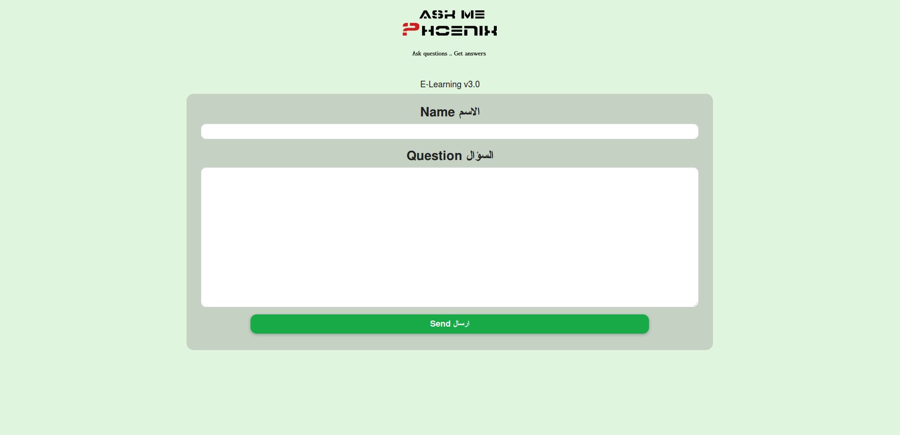
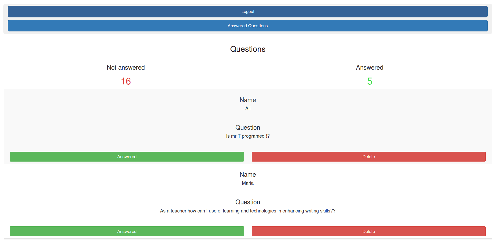
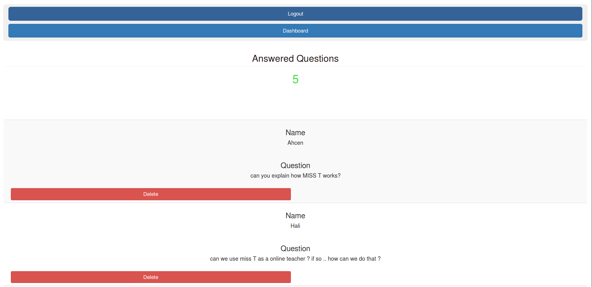

# **Ask Me** #
## Web based question ask system ##  

1- Update database informations in <b> Php/db_connex.php </b>

2- Create an ampty database named Q&A then import the database Q&A.sql file in your database to get the tables loaded

3- Default admin user/pass : <b> admin/askme </b>

4- to access admin panel you have to login in <b> <your_local_or_remote_Server_adresse>/l.php </b>

To change logo : check in picture folder

This tool has been tested in two events of Phoenix Club of Laghouat and it did great !
the only limitation is with the hardware infrastructure to use to be able to hundle the big number of users one time 

this tool was used in a Virtual Linux server configured to redirect all trafic to this web interface

 

<b> Ask_Me </b> is licensed under the <b> GNU General Public License v3.0 </b>

 

<b> User Interface </b>

<b> Admin Interface </b>

